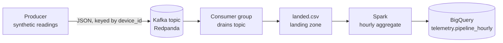

# Telemetry Pipeline (capstone)

An end-to-end data pipeline over a single dataset: **stream** telemetry through Kafka,
**land** it, **transform** it in Spark, and **load** the result into a BigQuery warehouse —
four stages, one command. This is the capstone tying together three companion projects.

## Architecture



## The four stages (`pipeline.py`)

1. **Stream** — produce ~500 readings to a fresh Kafka topic (Redpanda), keyed by device_id.
2. **Land** — a consumer group drains the topic into `landed.csv`.
3. **Transform** — Spark computes the hourly aggregate (avg value + count per device / metric / hour).
4. **Warehouse** — the result loads into BigQuery (`telemetry.pipeline_hourly`).

## Run it

Prerequisites: the Redpanda broker running (`docker compose up -d`) and the BigQuery
service-account key at the path set in the script.

```bash
python pipeline.py
```

## How it fits — the wider platform

This capstone reuses the concepts from three companion repos, each built and documented on its own:

- **telemetry-warehouse** — dbt star-schema warehouse on DuckDB + BigQuery (the modeling / serving layer)
- **telemetry-spark** — PySpark batch processing at 2M-row scale, parity-checked against DuckDB
- **telemetry-streaming** — Kafka (Redpanda) producer + consumer group landing to DuckDB

Batch and streaming over the same telemetry, modelled into a tested warehouse — the shape of a real data platform.

## Stack

Kafka (Redpanda) · confluent-kafka · PySpark · Google BigQuery · dbt (warehouse layer)

## Notes

Learning / portfolio capstone. `landed.csv` is git-ignored (it regenerates each run); the
BigQuery target is a free sandbox.
